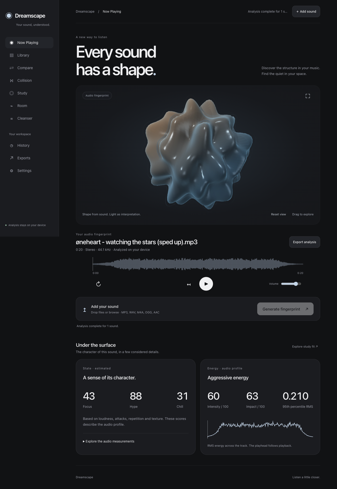

# Dreamscape

### Every sound has a shape.

**Browser-local analysis | Interactive WebGL | Mobile-first | No API keys**

[Features](#eight-features) · [Architecture](#architecture) · [Verification](docs/QA.md) · [Contributing](CONTRIBUTING.md)



*Actual application capture, not a mockup.*

Every sound has a shape. Dreamscape analyzes audio in your browser, builds an interactive spatial fingerprint, and helps you explore music and room acoustics.

## Run

Use Python 3 to serve the project:

```sh
python3 -m http.server 8000 --bind 127.0.0.1
```

Open http://127.0.0.1:8000. Microphone capture needs localhost or HTTPS. No JavaScript build, package installation, account, or API key is needed for the browser product.

## Eight features

- **Orb:** deterministic geometric audio fingerprint with a layered WebGL material, smoothed live response, drag/pinch/keyboard controls, reset and fullscreen.
- **State:** estimated focus, hype and chill profiles, with acoustic measurements available on demand.
- **Energy:** intensity and impact estimates, measured RMS statistics and a real energy curve.
- **Compare:** select any two session tracks; compare their brightness, attacks, repetition, recurrence and estimated tonal centers.
- **Collision:** an experimental spatial visualization of sound-signature similarity. It does not estimate interpersonal compatibility.
- **Study Sound Coach:** estimated fit for reading, writing, coding, memorization and recovery.
- **Room Scan:** live microphone spectrum and heatmap, activity estimates, named locations and relative location comparison.
- **Playlist Cleanser:** estimated support/disruption for a set of uploaded tracks, with the underlying measurements.

The custom player supports play/pause, seek, restart, volume and loop. Waveforms come from decoded audio. MP3, WAV, M4A, OGG and AAC support depends on the browser's decoder.

Library, history, audio and analysis are **session-only**. Appearance and motion preferences are saved locally. Export → Analysis JSON downloads the reports, measurements, interpreted scores, selected comparison, room summary and marked locations. Export also works after a room-only scan.

## Architecture

- `index.html`: accessible application shell and player.
- `styles.css`: responsive system typography, graphite/light materials, sidebar and mobile navigation.
- `app.js`: existing audio analysis, microphone lifecycle, playback, session state and export.
- `experience.js`: navigation, feature views, empty states, preferences and waveform drawing.
- `orb.js`: dependency-free WebGL mesh, shader material, deterministic fingerprint and camera controls.

There is no Astra UI dependency; Astra refers to the model used during development.

The browser analyzer calculates frame spectra, RMS, zero crossings, attacks, modulation, structural segmentation, symbolic repetition, MFCC summaries, chroma, an HPCP-style profile, approximate CQT-style bands, recurrence and tonal estimates. The CQT-style profile is a frequency-bucket approximation, not librosa's CQT transform. Stereo width for the orb is measured from left/right difference energy.

The orb uses a 6,305-vertex spherical topology with a continuous audio-derived radial field. Frequency balance, repetition, tonal strength, brightness, duration and measured stereo width establish its baseline. Live waveform energy, peaks and frequency balance animate it with damping. Lighting and color are visual mappings. GPU resources are released when views leave the document. Rendering is capped at 30 fps and skipped for hidden/offscreen canvases; reduced-motion and lower-resolution options are available.

## Interpretation boundaries

The measurements describe audio. State, task fit, interruption and similarity scores are rules-based estimates; they are not measured cognitive, physiological or medical effects. Voice-range activity also includes instruments and other sounds. Microphone levels are device-relative, not calibrated sound-pressure levels. Compare room locations using the same device and setup.

The current browser product has no Spotify connection, EEG/EMF upload, QRNG panel or cloud library.

## Deploy

The application is static and can be deployed on Vercel. The supplied `vercel.json` allows same-origin microphone access and revalidates unversioned JavaScript/CSS to avoid stale deployments. Local recordings, Python tools, snapshots and generated outputs are excluded by `.vercelignore`.

## Optional Python analysis

`sound_analyzer.py` is a separate local batch tool, not called by the web app. It uses librosa and mne, with optional Essentia.

```sh
./bootstrap_python_env.sh
source .venv/bin/activate
python sound_analyzer.py "path/to/audio.mp3" --out-dir analysis_output
```

Install `requirements-essentia.txt` for its optional key/HPCP/rhythm extras. Native EEG and CSV correlation remain capabilities of the Python tool. The legacy local server API is not used by the browser product.

## Verification

```sh
node --check app.js
node --check experience.js
node --check orb.js
python3 smoke_check.py
node tests/analysis-smoke.mjs
```

Or run all local checks with `sh scripts/check.sh`.

The smoke check checks static contracts; it is not a substitute for browser interaction tests. See [the verification report](docs/QA.md) for tested flows and limitations.

## Repository guide

| Location | Purpose |
| --- | --- |
| Root HTML, CSS and JavaScript | Static browser product; no build step |
| `docs/` | Dated verification evidence and UI capture |
| `tests/` | Repeatable deterministic audio-analysis tests |
| `scripts/` | Developer check commands |
| Root Python tools | Optional local server and batch analysis |
| `.github/` | Contributor issue templates |

Bring your own audio. Recordings, generated analysis output, environment files,
compiler caches and old UI snapshots stay local and are excluded from Git.
